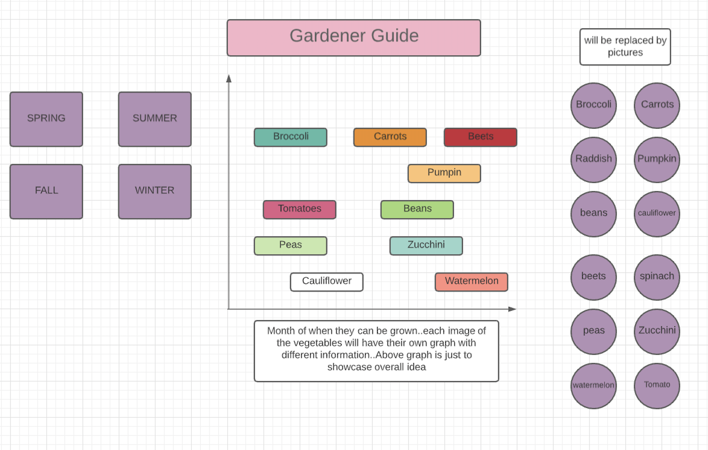

# Garden_Calendar

Background

Garden_Calendar is a planting guidance for beginner Gardener. 
It will teach the gardener when to plant certain vegetables and how to plant 
them. It will also indicate the suitable temperature condition for the plants to
grow indoor or outdoor. 

Functionality And MVPs

In Garden_Calendar, users will be able to:
. Click on the season box which will display the vegetables that 
  can be grown in that season. The season box will stay in the middle unless a 
  season is picked which will force it to go to the left side. 
. Click on the season box will also displays the graph that shows what month 
  each veggies should be planted.
. If the vegetable is picked it will show how to and when to grow them.
. If the vegetable is picked it will change the graph so that it only shows the 
  graph of the vegetable that was picked;

 In addition, this project will include:
. A production README 

Wireframes

 

. Nav links include links to this project's Github repo, and my LinkedIn.
. On the left, it will have the seasons
. In the middle, it will have the graph
. On the right, it will have the pictures of the veggies
. Both left and right will have clickable link

Technologies, Libraries, APIs

This project will be implemented with the following technologies:

I could not find any APIs related to the garden information that I need so I will be hardcoding it myself.
I will be using the information that is provided on back of the seed packets that I have to get most of the information about how to grow them and when. 
If I need more details then I will have to search on the website that I usually buy seeds from.

Implementation Timeline
NB:

Friday Afternoon & Weekend: Setup project, including getting webpack up and running. Get canvas to show up on the screen, and spend time getting comfortable with the Canvas API. Find the picture that I can potentially use. Research ways to graph and show data more smoothly.

Monday: I will collect data to add on the graph example when to grow them and the temperature the seeds need to germinate. 

Tuesday: Try to work on the picture and place them in correct position. Try to make all the clicks and button works. 

Wednesday: Finish implementing user controls, and focus on styling, as well as implementing the different color schemes and nav links. 

Thursday Morning: Deploy to GitHub pages. If time, rewrite this proposal as a production README.

