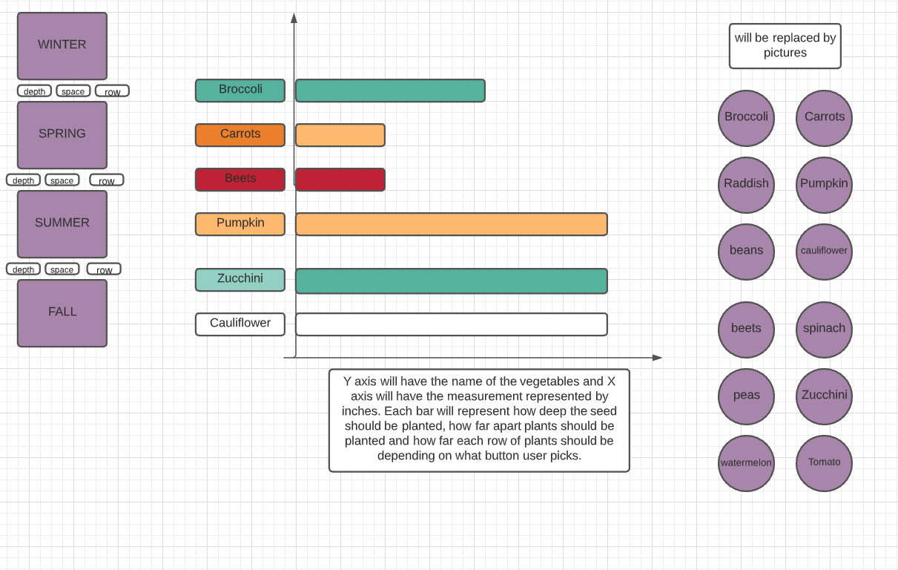

# Garden_Calendar
Live link https://dreamdivine.github.io/Garden_Calendar/
Background

Garden_Calendar is a planting guidance for beginner Gardener.
It will teach the gardener when to plant certain vegetables and how to plant
them. It will also indicate the suitable temperature condition for the plants to
grow indoor or outdoor. On the left side, there will be four icon/box representing each seasons (winter, spring, summer and fall). When the user hover over the icon, it will state what buttons below the icon represent and what they show. In the middle of the page, there will be a graph which will change based on what the button the user clicks. The three buttons are depth, spacing and row. On the right, there will be icons representing all the vegetables. When the user hovers around the icon, it will say what vegetable and upon clicking on it, it will give user the guide about how to grow it.  

Functionality And MVPs

In Garden_Calendar:
.The four season icon will display the function of each buttons below the icon when the user hovers over the specific season. 
.The four season will be represented by picture of images that represent each season but to make sure that user does not get confused about the picture, when they hover over it, it will state the specific seasons. 
.Below each seasons, there will be three buttons (depth, spacing, row). 
.The season icon will state what depth, spacing and row represents. For instance, when the user clicks on the depth button below the winter, it will show the graph of how deep the vegetables thats specifically grown in winter should be planted. When the user clicks on the spacing below winter icon, it will show how much spacing between each winter plants should be provided and the row button below winter, represents row spacing for the winter vegetables.  
.The graph was created using the chart.js library. When you hover over the bar in the graph, it will show the number in inches in case the user has hard time getting the exact number in inches.
.On the left side, there are about 39 vegetables and when you hover over it, it shows what they are (in case the image is too small for the user to identify). Upon clicking each buttons, it will open a window which will guide user how to grow each vegetables. 
.There is close button in the window box represented by X, the user can click on the X to exit out of the window.

 In addition, this project will include:
. A production README

Wireframes

. Nav links include links to this project's Github repo, and my LinkedIn.
. On the left, it will have the seasons
. In the middle, it will have the graph
. On the right, it will have the pictures of the veggies
. Both left and right will have clickable link

Technologies, Libraries, APIs
I will use chart.js as my library to create the graph. 

This project will be implemented with the following technologies:

I could not find any APIs related to the garden information that I need so I will be hardcoding it myself.
I will be using the information that is provided on back of the seed packets that I have to get most of the information about how to grow them and when.
If I need more details then I will have to search on the website that I usually buy seeds from.

Implementation Timeline
NB:

Friday: I am spending most of the friday, coming up with a timeline so it can help me through out my project. Then I will start on adding web pack and babel into my project file.I will try to find all the vegetables pictures that I can possibly use for the project..ie vegetable pics and the pictures i can use for the seasons. I will also do research on each vegetable seeds and when they can be planted. I will also do research on html and css so I have better understanding of how to effective use it.    

Saturday: My goal is to have html done for at least for the main page (where it will show four seasons), the second page where it will have boxes and button for all the vegetables. Then I will work on the third page which is a graph of months when each vegetable can be grown. 

Sunday: I will work on fourth page where I can add details on the each vegetable icons/button.Then I will focus on CSS for all the four pages.   

Monday: I will continue working on the css part and also incorporate JS with the css. I would do more research on JS so I have better understanding of how it can be made more interactive. 

Tuesday: I will focus on making the graph and the pages more interactive. Most of tuesday will be making the overall pages more colorful and pleasing to the user. If time allows, I will be see if I want to corporate virtual background on the pages.   

Wednesday: I will be mainly focusing on making the project more presentable and more interactive. I will asking others teammate and my project leader for feedback they can provide me on my project then implementing the changes.  

Thursday Morning: Deploy to GitHub pages. If time, rewrite this proposal as a production README.

