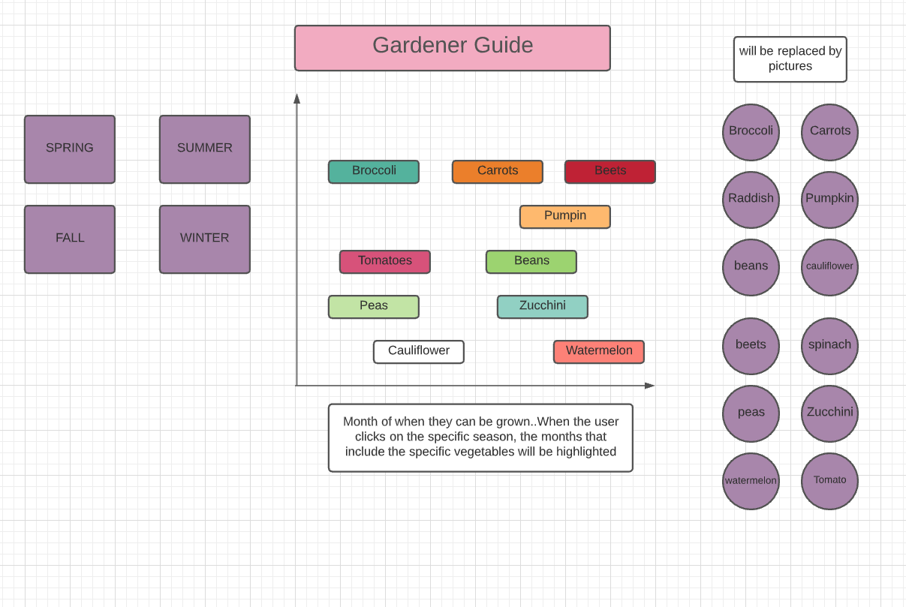

# Garden_Calendar

Background

Garden_Calendar is a planting guidance for beginner Gardener.
It will teach the gardener when to plant certain vegetables and how to plant
them. It will also indicate the suitable temperature condition for the plants to
grow indoor or outdoor.

Functionality And MVPs

In Garden_Calendar, users will be able to:
. Click on the season box which will display the vegetables that
  can be grown in that season. The season box will stay in the middle unless a
  season is picked which will force it to go to the left side.
. Click on the season box will also displays the graph that shows what month
  each veggies should be planted.
. If the vegetable is picked it will show how to and when to grow them.
. If the vegetable is picked it will change the graph so that it only shows the
  graph of the vegetable that was picked;

 In addition, this project will include:
. A production README

Wireframes

. Nav links include links to this project's Github repo, and my LinkedIn.
. On the left, it will have the seasons
. In the middle, it will have the graph
. On the right, it will have the pictures of the veggies
. Both left and right will have clickable link

Technologies, Libraries, APIs

This project will be implemented with the following technologies:

I could not find any APIs related to the garden information that I need so I will be hardcoding it myself.
I will be using the information that is provided on back of the seed packets that I have to get most of the information about how to grow them and when.
If I need more details then I will have to search on the website that I usually buy seeds from.

Implementation Timeline
NB:

Friday: I am spending most of the friday, coming up with a timeline so it can help me through out my project. Then I will start on adding web pack and babel into my project file.I will try to find all the vegetables pictures that I can possibly use for the project..ie vegetable pics and the pictures i can use for the seasons. I will also do research on each vegetable seeds and when they can be planted. I will also do research on html and css so I have better understanding of how to effective use it.    

Saturday: My goal is to have html done for at least for the main page (where it will show four seasons), the second page where it will have boxes and button for all the vegetables. Then I will work on the third page which is a graph of months when each vegetable can be grown. 

Sunday: I will work on fourth page where I can add details on the each vegetable icons/button.Then I will focus on CSS for all the four pages.   

Monday: I will continue working on the css part and also incorporate JS with the css. I would do more research on JS so I have better understanding of how it can be made more interactive. 

Tuesday: I will focus on making the graph and the pages more interactive. Most of tuesday will be making the overall pages more colorful and pleasing to the user. If time allows, I will be see if I want to corporate virtual background on the pages.   

Wednesday: I will be mainly focusing on making the project more presentable and more interactive. I will asking others teammate and my project leader for feedback they can provide me on my project then implementing the changes.  

Thursday Morning: Deploy to GitHub pages. If time, rewrite this proposal as a production README.

